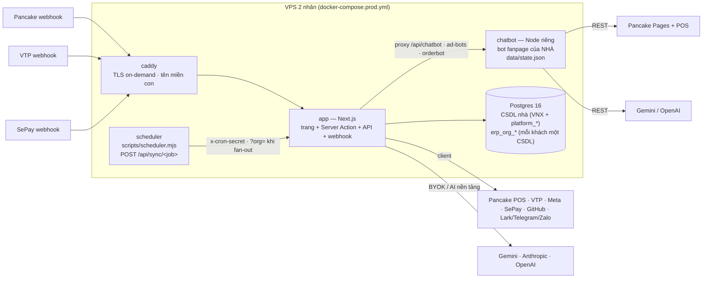
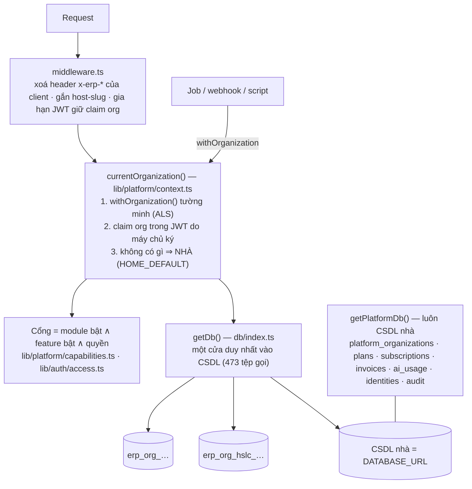
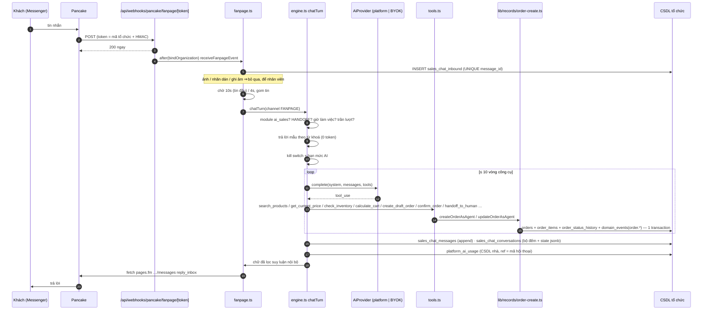

# Hiện trạng hệ thống (AS-IS) — nhìn từ sản phẩm AI Sales Agent

> Ảnh chụp `origin/main` **7e2edfce** (04/10/2026). Chỉ đọc mã; số production lấy từ tài liệu đã có, ghi
> rõ nguồn. Đọc kèm: `DOMAIN_MAP.md` (phân loại từng thành phần), `TECH_DEBT.md` (mã `TD-xx`).
> Tài liệu nền tảng trước đó vẫn đúng và không bị thay: `docs/platform/target-architecture.md` (vì sao SILO),
> `docs/platform/platform-boundary.md`, `docs/platform/tenant-readiness-audit.md`.

## 1. Một đoạn

Kho mã là **một ERP vận hành shop thời trang bán COD qua Pancake + Viettel Post (tổ chức "nhà", VNX)**, đã
được nâng thành **nền tảng đa tổ chức kiểu SILO** (mỗi tổ chức một CSDL Postgres, cùng mã nguồn, cùng tiến
trình). Trên nền đó có **hai** bot bán hàng: `chatbot/` — dịch vụ Node riêng phục vụ fanpage của nhà, ghi đơn
lên Pancake POS — và `lib/sales-chatbot/` — bot đa tổ chức chạy trong ERP, có công cụ đọc giá/tồn từ ERP và
tạo đơn qua lõi đơn của ERP. **Hải Sản Làng Chài (HSLC)** là tổ chức khách đầu tiên và đang dùng bot thứ hai
qua fanpage (kết nối Pancake) + trang `/chat`.

Lõi AI Sales đã **chạy được thật** cho một tenant. Thứ chưa có để bán cho nhiều tenant: đo lường (sổ sự kiện
hội thoại, ROI), lớp kênh, gói sản phẩm theo đơn vị AI, và tách luật ngành khỏi lõi.

## 2. Quy mô (đếm trên commit, lệnh đếm ở cuối tệp)

| Hạng mục | Số |
|---|---|
| Trang `page.tsx` | **159** (150 cần đăng nhập · 9 công khai/xác thực) |
| Route API `route.ts` | **41** (5 webhook · 7 máy-gọi-máy/công khai · 29 cần phiên) |
| Server Action (`lib/actions`) | 119 tệp |
| Truy vấn (`lib/queries`) | 222 tệp · 67.080 dòng |
| Hằng số/luật thuần (`lib/constants`) | 256 tệp · 52.791 dòng |
| Bảng (`pgTable`) | **207** · `db/schema.ts` 9.664 dòng |
| Migration | 194 (`0000`→`0194_pricing_2026_10`, thiếu số 0038) |
| Job nền đăng ký | 54 (42 tên có lịch · 12 chạy tay/ops) |
| Module trong sổ module | 27 khoá (`lib/constants/platform-modules.ts`) |
| Connector trong sổ | 25 (11 theo tổ chức · 14 chỉ nhà) |
| Tệp kiểm thử | 405 `*.test.ts` · 120.014 dòng |
| Tài liệu | 240 `.md` |
| `lib/` | 1.109 tệp · 251.868 dòng · `app/` 687 tệp · 100.056 dòng |
| Bot nhà `chatbot/` | 9.761 dòng JS (32 tệp `src`) + `admin/index.html` 1.217 dòng |
| Bot đa tổ chức `lib/sales-chatbot/` | 24 tệp · 6.083 dòng TS |

## 3. Kiến trúc AS-IS

### 3.1 Triển khai



Một tiến trình Next.js phục vụ mọi tổ chức. Job nền không chạy trong tiến trình app: container `scheduler`
gọi `/api/sync/<job>`; job của tổ chức khách đi qua tầng fan-out tuần tự (`scripts/scheduler-fanout.mjs`).

### 3.2 Đa tổ chức



- **Cô lập là tính chất cấu trúc**: không bảng nghiệp vụ nào có `org_id`; truy vấn viết sai vẫn không rò
  sang CSDL khác. Lý do chọn SILO (1.879 đoạn SQL thô / 253 tệp) giữ nguyên — xem
  `docs/platform/target-architecture.md` §2. **Tài liệu này không đề xuất đổi mô hình.**
- Người dùng nằm trong CSDL của từng tổ chức; RBAC 3 chiều (vai trò · chức danh · phạm vi, AGENTS §28–33) tự
  động đa tổ chức. Danh tính dùng chung để đăng nhập không cần mã tổ chức: `platform_identities`.
- Bí mật kết nối theo tổ chức: `org_connections` mã hoá AES-256-GCM, AAD gắn mã tổ chức
  (`lib/connectors/secrets.ts`). Credential trong `.env` chỉ dành cho nhà (`assertHomeCredentials`, 32 tệp).
- Tổ chức nhà khác khách: CSDL chứa mặt phẳng điều khiển, credential `.env`, lịch riêng, không bị tính phí
  (gói `internal`), `module_default = ENABLED`; module `ai_sales` **tắt** ở nhà (bot nhà là `chatbot/`).

### 3.3 Luồng một tin nhắn — bot đa tổ chức (HSLC)



Handoff: `handoff_to_human` / lỗi AI ⇒ `status = HANDOFF` + `handoffReason` ⇒ `notifications`, `user_messages`,
nhóm Lark/Telegram qua `lib/messaging`. Trên Pancake bot chỉ **im lặng** (không gắn tag). Nhân viên trả lời ⇒
bot nhường 30 phút. Job `sales-followup` (5 phút, fan-out) làm: quét tin rơi lúc deploy, nhắc khách im lặng
(1h/6h/22h trong khung 24h), ghi đơn từ hội thoại do NGƯỜI chốt (`order-sync.ts`, công tắc mặc định tắt), tin
sáng khách đến hạn mua lại, tự học bài học mỗi 6 giờ.

### 3.4 Luồng một tin nhắn — bot nhà (`chatbot/`)

Pancake (webhook `?secret=` hoặc poll 5–15 s) → `bot.js` lấy 12–20 tin gần nhất → Gemini/OpenAI qua lớp
provider riêng → chốt chặn giá/size/mã mẫu → trả lời qua Pancake. Đơn: AI trích JSON rồi **POST/PUT đơn nháp
lên Pancake POS** (`chatbot/src/orders.js:778-781`) — ERP chỉ thấy đơn ở lượt đồng bộ Pancake 3 phút sau.
Handoff = tag "BOT OFF" trong Pancake. Trạng thái và chi phí AI ở tệp JSON trong volume. ERP chỉ nói chuyện với
bot qua proxy `/api/chatbot/[...path]` (giao diện quản trị nhúng iframe) và hai đầu `/api/orderbot`,
`/api/erp/ad-bots`.

### 3.5 Hai chế độ thương mại theo tổ chức

`SYNCED_SOURCE_MODULE = {orders, products, customers} → "connector_pancake"` (`lib/platform/capabilities.ts:120-132`):

| | Nhà (VNX) — bật `connector_pancake` | Khách (HSLC) — tắt |
|---|---|---|
| Nguồn sự thật đơn/khách/sản phẩm | Pancake POS (ERP là bản sao, ghi đè mỗi lượt đồng bộ) | ERP (`erp-<uuid>`) |
| Tạo đơn trong ERP | **Bị chặn** (`order-create.ts:87`) | Qua `lib/records/order-create.ts` |
| Bot dùng được | `chatbot/` (ghi lên POS) | `lib/sales-chatbot` |
| Vận chuyển | Viettel Post (webhook + import + bảng kê COD) | Phiếu giao ký nhận, phí giao cố định |
| Kết cục đơn | `ORDER_OUTCOME` — chứng từ VTP rồi luật COD | Nhánh `erp-` của cùng `ORDER_OUTCOME` |
| Tiền | Bảng kê VTP · `cod_collected` · sổ ngân hàng | `order_payments` |

Có **7 đường tạo đơn**: đồng bộ Pancake · landing → POS · bot nhà → POS · form đơn tay · bot đa tổ chức ·
ghi đơn từ hội thoại người chốt · script seed. Ba đường đi qua lõi chung (`lib/records/order-create.ts`).

## 4. Các hệ AI đang chạy

| Hệ | Việc | Lớp provider | Sổ chi phí |
|---|---|---|---|
| `lib/sales-chatbot` | Bot bán hàng của tổ chức khách | `lib/ai-builder/providers.ts` (BYOK + AI nền tảng `platform`, mặc định `gemini-3.5-flash-lite`) | `platform_ai_usage` |
| `chatbot/` | Bot bán hàng của nhà, vision, voice, persona theo quảng cáo | Lớp riêng `ai.js`/`gemini.js`/`openai.js` (mặc định `gemini-2.5-flash` trong mã) | `chatbot/src/aicost.js` (JSON) |
| Copilot ERP | Hỏi đáp có công cụ cho nhân viên nhà | `lib/ai/provider.ts` + `router.ts` (Anthropic/OpenAI theo bậc) | `ai_interactions` + `platform_ai_usage` |
| AI Builder | Soạn blueprint cấu hình | `lib/ai-builder` | `platform_ai_usage` |
| AI CTO / agent runner | Lập kế hoạch + viết mã cho chính kho này (GitHub Actions) | `lib/ai` | `tech_agent_runs.metadata` |
| CS semantic | Phân loại hội thoại Pancake của nhà | `lib/ai` | `ai_interactions` |
| Creative / Video Scale | Sinh ảnh, caption, video, TTS, nhạc cho quảng cáo của nhà | Gọi thẳng OpenAI Responses / Images / Veo / Omni / Lyria | `ai_interactions` + cột riêng |

Lời nhắc nằm ở 7 nơi (`lib/ai/prompt.ts`, `lib/agents/cto.ts`, `lib/constants/agent-system-prompt.ts`,
`lib/ai-builder/prompt.ts`, `chatbot/prompts/system.md`, `lib/sales-chatbot/engine.ts` + sổ tay/bài học,
writer của creative/video-scale).

## 5. Đo lường và sự kiện hiện có

| Nguồn | Độ mịn | Dùng được cho AI Sales analytics? |
|---|---|---|
| `sales_chat_messages` | từng khối tin (cả tool_use / tool_result), append-only | **Có** — dựng lại được hội thoại, QA, bộ hội thoại vàng |
| `sales_chat_inbound` | tin vào theo 3 giọng KHÁCH / BOT_SENT / PAGE_REPLY | **Có** — phân biệt "người có chạm vào" ở mức nhóm |
| `sales_chat_conversations` | bộ đếm cộng dồn + `state` jsonb hiện tại | Một phần — **không có mốc chuyển bước**, `state` bị xoá khi sang lượt mua mới |
| `platform_ai_usage` | mỗi lượt AI: org, feature, token, cost (`NULL` = chưa biết), `ref` | **Có** — nhưng `feature` gộp quá thô (TD-06) |
| `domain_events` | 30 tên, append-only, `actor_kind`, `dedupe_key` | Chỉ `order.*` cho đơn `erp-`; **không** có sự kiện hội thoại |
| `audit_logs` | thao tác người/máy, `actor_kind` USER/SYSTEM/AGENT/WEBHOOK | Truy vết, không phải luồng phân tích |
| `conversation_funnel` | hội thoại Pancake của **nhà**: mốc tin khách đầu, shop trả lời đầu, SĐT, địa chỉ, ghép đơn | Mẫu tốt cho vế "người" — nhưng chỉ nhà, `owner_name` là chữ |
| `lib/sales-chatbot/cost-report.ts` | ₫ AI / đơn chốt, ₫ AI / SĐT | Gần ROI nhất — nhưng "đơn" = bot chốt, chưa nối kết cục giao |
| `page_visit_daily` | (ngày, trang) — cố ý không có người | Không |

**Kết luận đo lường**: dữ liệu thô đủ để dựng lại gần hết, nhưng **chưa có dòng sự kiện có mốc** cho phễu hội
thoại và chưa có khoá đơn ↔ hội thoại; vế "người" không có danh tính nhân viên vì Pancake không gửi uid.

## 6. Bảo vệ đang có (phải giữ khi thay đổi)

- Contract test kết cục đơn (`tests/contract-order-outcome.test.ts`) — chặn deploy (AGENTS §0).
- Máy quét cô lập đa tổ chức (`tests/platform-isolation-static.test.ts`, 243 mặt chạy lại cô lập).
- Mọi `page.tsx`/`route.ts` thuộc đúng một module (bài kiểm của sổ module).
- `tests/repo-integrity.test.ts`, `migration-journal`, `migration-upgrade-path`, `test-hygiene` (AGENTS §9, §50, §65).
- Lõi bot: kiểm gián tiếp qua `self-service-journey.test.ts` (13 lời gọi `chatTurn`), `seafood-os.test.ts`,
  `sales-order-sync.test.ts`, `appointment-booking-bot.test.ts`, `chat-cost-report.test.ts`.
- Diễn tập khôi phục CSDL tổ chức hằng tuần (`restore-drill.yml`), PITR CSDL nhà.

## 7. Baseline kiểm thử — 04/10/2026, máy Windows của chủ shop

Chạy trên cây sạch `wt-productization-audit` (detached ở `origin/main` 7e2edfce), đúng thứ tự
`.github/workflows/gates.yml`, bằng Git Bash (AGENTS §65; PowerShell cho kết quả đỏ giả). `node_modules` nối
junction tới một cây có cùng `package-lock.json`.

| Bước | Lệnh | Kết quả | Thời gian |
|---|---|---|---|
| 1 | `tsx tests/repo-integrity.test.ts` | **Đạt** | 76 s |
| 2 | `tsc --noEmit` | **Sạch** | 107 s |
| 3 | `eslint --max-warnings=0` | **Sạch** | 37 s |
| 4a | `npm test` (ẩn danh) — lượt 1 | Hỏng vì máy: ổ C hết chỗ giữa chừng (3,3 GB → 30 MB do phiên khác), PGlite `errno 51` sau 576 dòng ✓ | 549 s |
| 4b | `npm test` (ẩn danh) — lượt 2, ổ C 145 GB | **640 dòng ✓** · 1 dòng ⚠ CHƯA ĐO ĐƯỢC (ổ khoá ops cần `flock`, không có trên win32) · dừng ở bài 390/423 với `could not create file "base/5/…": File exists` (58P02) | 722 s |
| 5 | `npm test` (token giả `GITHUB_TOKEN`) | Giống hệt 4b: 640 ✓ · cùng điểm dừng 58P02 | 767 s |
| 6 | 34 bài đuôi (390→423), mỗi bài một tiến trình | **33/34 đạt** · `testPilotOrders` hỏng khi chạy tách (giải thích dưới) | — |
| CI | `gates` trên GitHub Actions (Linux) cho đúng SHA 7e2edfce | **success** (03:23Z 04/10/2026) | — |

Đọc kết quả:

- **Điểm dừng 58P02 là lỗi PGlite trên Windows đã biết từ 29/09/2026** — lỗi đi theo lượt tạo CSDL tổ chức thứ
  N trong một tiến trình dài, không theo một bài; cùng commit thì CI Linux xanh. Không phải lỗi mã.
- **`testPilotOrders` chạy tách thì hỏng ở `ordersDistinct` 0 → 2**: bài kiểm cần CSDL nhà **đã có đơn Pancake**
  từ fixture của các bài trước trong bộ đầy đủ. Chạy tách, CSDL nhà rỗng ⇒ `ORG_HAS_SYNCED_ORDERS`
  (`lib/queries/manual-order-sql.ts`) trả "không đồng bộ" ⇒ đơn `erp-` vào báo cáo. Đó là tính chất của runner
  tách, không phải lỗi trên `main` (CI chạy bộ đầy đủ: xanh) — nhưng nó lộ ra nợ TD-32.
- Kết luận baseline: **typecheck, lint, toàn vẹn kho sạch; `npm test` đạt toàn bộ phần đo được trên máy này
  (640 + 33 bài), phần còn lại (1 bài phụ thuộc fixture, 1 bài cần `flock`) được CI Linux phủ và CI xanh.**
  Muốn baseline tuyệt đối trên một máy: chạy trên Linux/WSL.

## 8. Lệnh đếm chính

```bash
find app -name page.tsx | wc -l                       # 159
find app/api -name route.ts | wc -l                   # 41
grep -c 'pgTable(' db/schema.ts                       # 207
node -e "console.log(require('./drizzle/meta/_journal.json').entries.length)"   # 194
grep -rlE 'await getDb\(\)' lib app scripts | wc -l   # 473
find tests -name '*.test.ts' | wc -l                  # 405
wc -l lib/sales-chatbot/*.ts | tail -1                # 6083
wc -l chatbot/src/*.js | tail -1                      # 9761
grep -oE 'name: "[a-z_]+"' lib/sales-chatbot/tools.ts | sort -u | wc -l   # 16 công cụ
```
