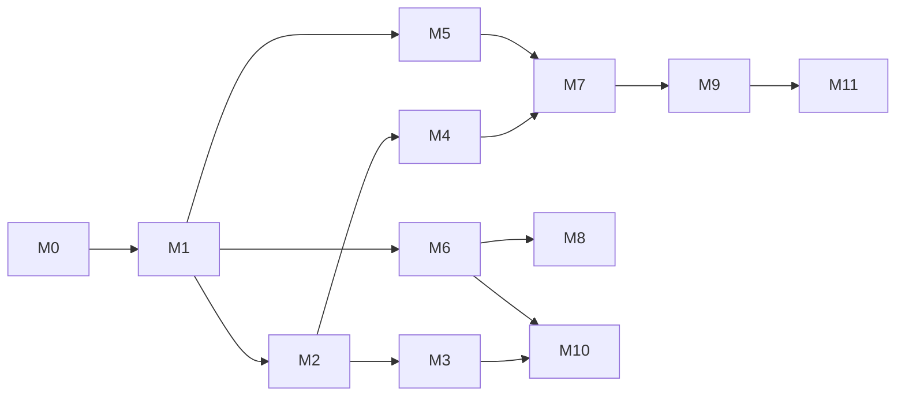

# Kế hoạch di trú tăng dần — từ ERP tới AI Sales Agent đa tenant

> Không big-bang. Mỗi bước là một PR (hoặc một chuỗi PR nhỏ cùng chủ đề) có thể deploy riêng, lùi riêng, và
> **không phá thứ đang chạy cho VNX và HSLC**. Mã nợ `TD-xx` ở `TECH_DEBT.md`; hình đích ở
> `TARGET_ARCHITECTURE.md`.

## 0. Luật chơi cho mọi bước

1. **Thứ tự: đo trước, sửa sau, gỡ cuối.** Bước nào đổi hành vi bot phải đứng sau bước có lưới kiểm (M1) và
   sau bước có số đo (M2) — để "trước/sau" là một con số, không phải cảm giác.
2. **Mỗi bước đều THÊM được mà không ai thấy khác** (cột nullable, bảng mới, công tắc mặc định giữ hành vi cũ),
   trừ khi bước đó được ghi rõ là đổi hành vi và có cổng người quyết.
3. **Migration viết tay, idempotent** (ghi nhớ dự án: `db:generate` hỏng từ ảnh chụp 0032); thêm tên vào `MOI`
   của `tests/migration-upgrade-path.test.ts`; va số thì `npm run migration:renumber`. Migration áp cho mọi CSDL
   tổ chức qua `scripts/verify-migrations.ts` sau deploy.
4. **Cổng trước khi gộp** (AGENTS §6, §9): cây sạch theo SHA ứng viên · typecheck · lint · `npm test` hai lượt ·
   build khi chạm ranh giới client/server. Sửa số liệu ⇒ đo production trước/sau và ghi vào commit.
5. **Không đụng**: `ORDER_OUTCOME`, `RETURN_RULE`, công thức sổ kho, id đơn, enum trạng thái đơn, kỳ lương đã
   chốt, `review_cycles` FINAL. Bước nào cần đụng phải dừng lại hỏi.
6. **Cổng người (HUMAN GATE)** ghi ở từng bước: không bước nào tự vượt.

## 1. Tổng quan

| Bước | Tên | Đổi hành vi? | Rủi ro | Cỡ | Đóng nợ | Cổng người |
|---|---|---|---|---|---|---|
| **M0** | Audit + baseline (tài liệu này) | Không | — | S | — | Duyệt hướng đi |
| **M1** | Lưới an toàn: bộ hội thoại vàng | Không | Thấp | M | TD-31 | — |
| **M2** | Sổ sự kiện hội thoại + khoá đơn ↔ hội thoại | Không | Thấp | M | TD-04, TD-05, TD-06 | — |
| **M3** | Gia cố Commerce Core cho agent | Có (chỉ đường agent) | Vừa | M | TD-01, TD-02, TD-03, TD-20, TD-32 | — |
| **M4** | Sales Analytics · Benchmark nhóm · ROI v1 | Không (màn mới) | Thấp | M | — | Chủ shop khai chi phí người (tuỳ chọn) |
| **M5** | Lời nhắc 4 tầng + gói ngành | Không với HSLC (giống từng ký tự) | Vừa | M | TD-09, TD-26 | — |
| **M6** | Lớp kênh + nhiều page mỗi tổ chức | Không (rút nguyên) → Có (nhiều page) | Vừa | M | TD-10, TD-11 | — |
| **M7** | Đóng gói "chỉ AI Sales" | Có (tổ chức mới) | Thấp–Vừa | M | TD-12, TD-16 | **Giá & đơn vị tính phí** |
| **M8** | Hộp thư người trong ERP | Có (tuỳ chọn theo tổ chức) | Vừa | L | TD-07 | Dùng thử với HSLC |
| **M9** | Gia cố nền tảng cho > 5 tenant | Có | Cao | L | TD-17, TD-18, TD-19, TD-29, TD-30 | **Tài khoản nhận tiền · ngân sách hạ tầng · đổi lịch** |
| **M10** | VNX dùng chính sản phẩm (dogfood), gỡ `chatbot/` | Có | **Cao** | L | TD-08, TD-25 (phần bot) | **Chủ shop duyệt từng page** |
| **M11** | Kênh mới (Messenger trực tiếp, Zalo OA, …) | Có (kênh mới) | Vừa | M/kênh | — | **Dịch vụ ngoài mới (AGENTS §7)** |

**Cập nhật 04/10/2026 theo quyết định của chủ shop (Q1 = dồn sức AI Sales, Q3 = không bắt buộc Pancake):** kênh trực
tiếp (M11) và lớp kênh (M6) lên ngay sau M2/M4. Messenger trực tiếp do phiên khác làm (nhánh `claude/messenger-truc-tiep`);
ô chat nhúng website đã có (#515). M2 + M4 = PR #522.

M1 → M2 là nền bắt buộc. M3 và M4 chạy song song được sau M2. M5, M6 cần M1. M7 cần M4 (để có số bán) và M5
(để tenant mới không nhận lời nhắc hải sản). M9 trước khi vượt ~5 tenant trả tiền. M10 cuối cùng.

---

## M0 · Audit và baseline — *đang ở đây*

- **Kết quả:** sáu tài liệu ở `docs/productization/`. Không đổi mã.
- **Baseline:** typecheck · lint · toàn vẹn kho sạch; `npm test` đạt mọi phần đo được trên Windows (640 + 33
  bài), phần còn lại CI Linux phủ và CI của 7e2edfce xanh (`CURRENT_STATE.md` §7).
- **Cổng người:** chủ shop duyệt hướng đi (đặc biệt bảng quyết định trong `AI_SALES_PRODUCT_SPEC.md` §9).

## M1 · Lưới an toàn: bộ hội thoại vàng — *đã làm (bản đầu), `tests/sales-agent-golden/`*

- **Đã có:** 10 hội thoại kịch bản (báo giá, trọn vòng lên đơn → chốt ghi thật, chốt khi khách chưa đồng ý, quá tồn, khách sỉ
  ⇒ chuyển người, khách từ chối, mã mẫu không có, rò chữ nội bộ, khung THỬ không ghi, gói ngành thời trang) phát lại qua ĐÚNG
  `chatTurn` với model giả; ảnh chụp lời nhắc + chuỗi công cụ + kết quả máy chủ + trạng thái cuối ở `snapshots/`. Đỏ ⇒ in
  đường dẫn khác đầu tiên; đổi cố ý ⇒ `npx tsx tests/sales-agent-golden/update.ts`. Chạy trong `npm test`.
- **Bộ vàng lộ ra ba chỗ khách bị IM LẶNG (chụp nguyên hành vi hiện tại — sửa là việc riêng, ảnh chụp sẽ đổi theo):**
  1. Model chỉ gọi `handoff_to_human` (không kèm chữ) ⇒ vòng lặp dừng, khách KHÔNG nhận câu chuyển người đã cấu hình
     (`khach-si-chuyen-nguoi`).
  2. Mọi chữ của model bị bộ lọc suy luận chặn và không gọi công cụ ⇒ lượt kết thúc không một câu (`ro-ri-chu-noi-bo`).
  3. Máy chủ từ chối chốt, model nhại lỗi công cụ ⇒ chữ bị lọc ⇒ khách không nhận gì (`chot-khi-chua-dong-y`, lượt 2).
- **Còn lại của M1:** hội thoại thật của HSLC (đã che) — cần thao tác ops chỉ-đọc; bộ kiểm phân loại giọng fanpage.

### Kế hoạch ban đầu

- **Mục tiêu:** mọi thay đổi về engine/kênh sau này phải chứng minh "không đổi hành vi" bằng máy, không bằng mắt.
- **Phạm vi:**
  - `tests/sales-agent-golden/` — 20–40 hội thoại lấy từ HSLC (che SĐT/tên/địa chỉ bằng bộ che của
    `playbook.ts`), phủ: báo giá, hỏi quy cách, khách sỉ → handoff, upsell, chốt, khách cũ, follow-up, bình luận,
    tiếng vọng bot, nhân viên chen vào.
  - Provider giả trả lời theo kịch bản; so **lời nhắc dựng ra** (ảnh chụp), **chuỗi công cụ**, **trạng thái
    cuối** (`stage`, `status`, `draftOrderId`).
  - Kiểm riêng `fanpage.ts`: phân loại giọng (KHÁCH / BOT_SENT / PAGE_REPLY / tự động) trên payload Pancake thật đã che.
- **CSDL:** không.
- **Thoát khi:** bộ chạy trong `npm test`; một thay đổi cố ý ở lời nhắc làm nó đỏ với thông điệp đọc được.
- **Lấy dữ liệu:** `db-query` không đọc CSDL tổ chức ⇒ cần một thao tác ops chỉ-đọc xuất hội thoại đã che của
  HSLC (thêm vào `ops-vps.yml`, không in khoá, không in SĐT).

## M2 · Sổ sự kiện hội thoại — *đã làm, PR #522*

- **Mục tiêu:** từ ngày deploy, mọi bước bán hàng có mốc — điều kiện của mọi con số ở M4.
- **CSDL (migration 0196, thuần THÊM, không backfill):** bảng `sales_conversation_events` (17 loại có CHECK,
  `dedupe_key` UNIQUE, append-only); `orders.origin` + `orders.sales_conversation_id` (CHECK thêm NOT VALID rồi VALIDATE).
- **Cách ghi — khác bản kế hoạch đầu, để không đụng vòng công cụ đang bị sửa hằng ngày:** bọc lượt hội thoại
  `chatTurn = withTurnEvents(chatTurnCore)` (engine.ts đổi một dòng), suy sự kiện bằng hàm THUẦN so ảnh chụp trước / sau
  lượt; móc một dòng ở nhân viên nhận hội thoại (fanpage), nhắc khách (followup), AI ghi đơn hộ nhân viên (order-sync,
  actor HUMAN), «Trả lại cho AI» (users.id). Đơn của AI được gắn khoá hội thoại ngay sau lượt.
- **Không tách `feature` của sổ AI:** lượt ghi đơn hộ nhân viên đã mang `ref = "order-sync:…"`, khung thử nhận ra qua
  kênh của hội thoại — màn hiệu quả tách bằng hai dấu đó, không cần đổi danh sách feature.
- **Ghi sau, ngoài giao dịch** (luật 51): lỗi ghi sổ không làm khách mất câu trả lời; in `[sales-events]` + màn hình in
  độ phủ của sổ. **Lùi:** revert PR — bảng ở lại, không ai đọc.

## M3 · Gia cố Commerce Core cho agent

- **Mục tiêu:** khi mở thêm công cụ / kênh / agent, không đường nào bán sai giá hay bán quá tồn.
- **Mã:**
  - `lib/commerce/` mặt tiền: `CatalogService`, `PricingService`, `CustomerService`, `OrderService`
    (`TARGET_ARCHITECTURE.md` §4 ⑤). `tools.ts` chuyển sang gọi mặt tiền; hành vi giữ nguyên.
  - Đường **agent**: đơn giá do `PricingService` tính trong lõi; giá người gọi gửi chỉ là "giá kỳ vọng" để báo
    "giá vừa đổi". Đường **form tay** không đổi.
  - Tồn khả dụng + hạn mức nợ kiểm **trong** transaction ghi, khoá `pg_advisory_xact_lock` theo mẫu mã.
  - `idempotencyKey` trên `OrderService.draft` (cột UNIQUE nullable trên `orders`).
  - Một hàm chuẩn hoá SĐT dùng chung (`lib/constants/phone.ts`); `createCustomerAsAgent` dùng khoá tư vấn theo
    SĐT để chặn đua. **Không** thêm UNIQUE cứng vào `customers.phone` khi chưa đo số SĐT trùng
    trong dữ liệu nhà (khách Pancake có thể trùng SĐT hợp lệ — chưa đo).
- **Kiểm:** hai chốt đơn đồng thời cho món cuối ⇒ một qua, một bị từ chối có lý do; công cụ giả truyền giá sai ⇒
  đơn vẫn mang giá bảng; gọi `draft` hai lần cùng khoá ⇒ một đơn. `tests/seafood-os.test.ts`,
  `self-service-journey.test.ts` xanh nguyên.
- **Rủi ro:** VỪA — đổi đường ghi đơn của bot đang bán thật. Deploy giữa tuần, giờ thấp điểm của HSLC; đọc
  `sales_chat_conversations.handoff_reason` trước/sau 48 giờ.
- **Không đụng:** `ORDER_OUTCOME`, công thức sổ kho, nhánh Pancake của nhà.

## M4 · Sales Analytics, Benchmark nhóm, ROI v1 — *đã làm, PR #522* (`/ai/sales-chatbot/performance`)

- **Mục tiêu:** chủ shop thấy được AI mang lại gì, bằng số có độ phủ.
- **Mã:**
  - Chỉ số `ai_sales.*` vào `METRIC_CATALOG` (đề xuất ở `TARGET_ARCHITECTURE.md` §5.2), mỗi chỉ số đủ mười hai
    trường; chỉ số chưa đo được khai `UNAVAILABLE` kèm `missingWhat` (vd "theo từng nhân viên").
  - Tab "Hiệu quả" ở `/ai/sales-chatbot`: phễu theo bước, lý do handoff, nhóm `AI_ONLY` / `AI_THEN_HUMAN` /
    `HUMAN_ONLY`, doanh thu giao thành công qua `ORDER_OUTCOME` + độ phủ kết cục, chi phí AI / đơn giao thành công.
  - Ô "chi phí một hội thoại do người làm" — chủ shop khai (MANUAL, nhãn ước tính, có người khai + lý do).
- **Kiểm:** tổng hội thoại các nhóm = tổng hội thoại kỳ (như luật marketer §3.9); kỳ trước ngày bật M2 in "chưa
  đo"; mẫu dưới ngưỡng ⇒ `null`.
- **Cổng người:** chủ shop đọc màn hình với dữ liệu HSLC thật và xác nhận định nghĩa "AI tự bán" trước khi số này
  được dùng để bán hàng cho khách khác.

## M5 · Lời nhắc 4 tầng và gói ngành

- **Mục tiêu:** tenant thứ hai (không phải hải sản) không nhận ví dụ "chả cá thu".
- **Mã:** tách `systemPrompt()` thành luật lõi + gói ngành + hồ sơ shop + sổ tay/bài học. Gói ngành là dữ liệu
  gắn vào blueprint (một trường của `lib/blueprints`, không phải bộ mẫu thứ tư). Gói đầu tiên `seafood` chứa
  nguyên văn phần hải sản hôm nay; gói `generic` cho tenant chưa chọn ngành; `fashion` lấy từ
  `chatbot/prompts/system.md` (phục vụ M10).
- **Kiểm:** lời nhắc của HSLC trước/sau **giống hệt từng ký tự** (ảnh chụp ở M1). Stopword tìm kiếm, regex đơn
  vị, trọng lượng từ tên đi theo gói.
- **Dọn kèm:** `ORG_TEMPLATES` và `BUSINESS_TYPE_SPEC` trỏ về blueprint (TD-26).

## M6 · Lớp kênh và nhiều page

- **Bước 6a (không đổi hành vi):** rút `fanpage.ts` thành `lib/channels/pancake-fanpage.ts` theo hợp đồng
  `ChannelAdapter`; `public.ts` thành `web-chat`. Hội thoại vàng + bộ kiểm phân loại giọng xanh nguyên.
- **Bước 6b (đổi hành vi, có công tắc):** connector `pancake-fanpage` nhận nhiều page (một kết nối mỗi page, URL
  webhook riêng mỗi page); `sales_chat_conversations.channel_account_id`; cấu hình bot có thể khác nhau theo page
  (persona, giờ làm việc).
- **Bước 6c:** ảnh khách gửi chuyển cho engine khi tổ chức bật năng lực vision (rút từ `chatbot/src/vision.js`).
- **Rủi ro:** VỪA — heuristic tiếng vọng/nhân viên là chỗ dễ vỡ nhất (bot chen ngang hoặc im lặng).

## M7 · Đóng gói "chỉ AI Sales"

- **Mục tiêu:** một shop đăng ký chỉ để dùng AI bán hàng, không thấy 150 trang ERP.
- **Mã:**
  - `ai_sales.dependsOn` bỏ `inventory` (tồn chưa biết là trạng thái hợp lệ).
  - Blueprint `ai-sales` bật: core, customers, products, orders, ai_sales (+ appointments tuỳ ngành); menu gọn:
    Hội thoại · Sản phẩm & giá · Đơn · Khách · Hiệu quả · Cài đặt.
  - Đơn vị tính trong `entitlements`: hội thoại AI xử lý / tháng, số kênh (page), credit AI (đã có). Vượt hạn ⇒
    bot chuyển người kèm lý do, **không** im lặng với khách.
  - `/start` có lối "AI bán hàng" → kết nối fanpage một nút → nạp sản phẩm (nhập tệp hoặc tay) → thử ở kênh TEST →
    bật (phần lớn đã có từ #504).
- **Cổng người:** giá gói và đơn vị tính phí là quyết định kinh doanh (bảng ở `AI_SALES_PRODUCT_SPEC.md` §8).

## M8 · Hộp thư người trong ERP

- **Mục tiêu:** nhân viên nhận hội thoại handoff và trả lời ngay trong ERP ⇒ có `users.id` cho câu trả lời của
  người ⇒ mở khoá benchmark theo NGƯỜI và đo thời gian nhận handoff.
- **Mã:** màn hộp thư theo `control`; trả lời đi qua `ChannelAdapter.send` với page token của tổ chức; sự kiện
  `handoff.accepted` mang `actor_user_id`; nguồn việc `SALES_HANDOFF` trên `/work` dạng phép chiếu (AGENTS §19).
- **Không bắt buộc:** nhân viên vẫn trả lời được trong Pancake như cũ — khi đó câu trả lời là `PAGE_HUMAN` không
  danh tính, và chỉ số theo người vẫn `UNAVAILABLE` cho hội thoại đó.
- **Cổng người:** dùng thử với một nhân viên HSLC trước khi khuyến nghị cho tenant khác.

## M9 · Gia cố nền tảng cho > 5 tenant

Không cần cho 2–5 tenant pilot; bắt buộc trước khi bán đại trà.

| Việc | Nợ | Ghi chú |
|---|---|---|
| Ngữ cảnh rỗng ⇒ lỗi, trừ danh sách trắng tuyến của nhà | TD-19 | Chạy chế độ chỉ-ghi-log 1 tuần trước khi ném lỗi |
| Vai trò `platform:operate` riêng, không đi kèm ADMIN nhà | TD-18 | Đổi quyền ⇒ hỏi chủ shop (AGENTS §7) |
| Đối soát thuê bao không đọc sổ ngân hàng của VNX (tài khoản nhận tiền riêng của nền tảng) | TD-17 | **Cổng người:** tài khoản nhận tiền |
| Chống dò đăng nhập + đệm sổ tổ chức ra khỏi bộ nhớ tiến trình | TD-29 | Khi có > 1 instance |
| Ngưỡng 1 của `docs/platform/scale-plan.md`: tách máy CSDL, PgBouncer, worker riêng, fan-out song song có trần | TD-30 | **Cổng người:** ngân sách + đổi lịch scheduler |
| Mặt phẳng điều khiển ra CSDL riêng | TD-17 | Chỉ khi vận hành đòi; rủi ro CAO |

## M10 · VNX dùng chính sản phẩm, gỡ `chatbot/`

Bước rủi ro nhất: bot nhà đang trả lời ~10 page, 600–1.000 lượt/ngày.

1. **Rút năng lực** còn thiếu ở bot đa tổ chức: vision (so ảnh khách với ảnh sản phẩm), voice (chép ghi âm),
   persona theo `ad_id`, tra size bằng mã, chốt chặn giá/size/mã mẫu (chín nhóm trong
   `docs/ban-giao/BAN-GIAO-BOT-CHAT-CHO-ERP.md`) — mỗi cái thành công cụ hoặc năng lực kênh, có hội thoại vàng
   lấy từ log bot nhà.
2. **`PancakePosSink`**: `OrderService` ghi đơn lên Pancake POS cho tổ chức đồng bộ đơn (gỡ chặn
   `order-create.ts:87` chỉ cho đường agent + sink POS), để ERP và POS không có hai bản một lần mua.
3. **Chế độ bóng** trên 1 page: bot mới soạn câu trả lời nhưng không gửi; so với câu bot cũ đã gửi; chủ shop đọc
   mẫu.
4. **1 page thật** → đo 2 tuần bằng M4 (so nhóm, không so cảm giác) → từng page tiếp theo, mỗi page một lần chủ
   shop duyệt.
5. Khi page cuối chuyển xong: tắt container `chatbot`, DEPRECATE `/api/chatbot`, `/chatbot`,
   `lib/integrations/chatbot`. Giữ volume `chatbot_data` (lịch sử) — không xoá dữ liệu.

## M11 · Kênh mới

Mỗi kênh là một adapter + một connector PER_ORG + `testConnection` + `sync_runs` + mục trong trang Kết nối
(AGENTS §5). Thứ tự đề xuất theo giá trị cho social commerce Việt Nam: Messenger trực tiếp (bỏ phụ thuộc
Pancake) → Zalo OA → Instagram → TikTok Shop chat. **Mỗi kênh là dịch vụ ngoài mới ⇒ hỏi chủ shop trước.**

---

## Phụ lục — đo trước/sau (AGENTS §6.5)

| Bước | Đo gì trên production trước và sau |
|---|---|
| M2 | số sự kiện/ngày theo loại · tỷ lệ lỗi ghi · thời gian phản hồi bot p50/p95 (không được tăng) |
| M3 | số đơn bot/ngày · số lần "giá vừa đổi" · số lần "không đủ hàng" · số đơn trùng (phải về 0) |
| M5 | lời nhắc HSLC giống hệt · tỷ lệ handoff 7 ngày trước/sau |
| M6 | tỷ lệ bot chen ngang khi nhân viên đang trả lời · số tin khách không được trả lời |
| M10 | theo từng page: tỷ lệ ra đơn, tỷ lệ giao thành công, chi phí AI/đơn — so nhóm cùng kỳ |
